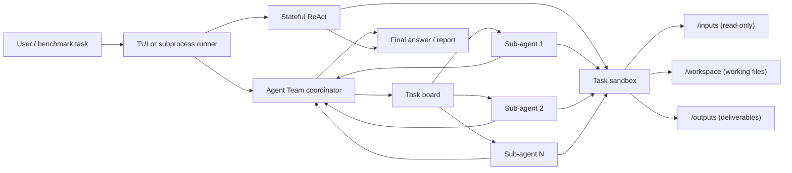

Tech Blog ·
 Tech Report 

# FrontierAgent

FrontierAgent is an open-source agent runtime, terminal product, and evaluation
suite for long-horizon research and file-based work. The `frontier-agent` TUI
ships two native workflows:

- **ReAct** — one stateful agent researches, reads files, writes deliverables,
 runs commands, and iterates in a task-scoped sandbox.
- **Agent Team** — a coordinator maintains a task board, delegates independent
 work to parallel sub-agents, collects their reports, and synthesizes the result.

The same workflow engine powers the benchmark runner used to evaluate Apodex
models. The framework, tools, workflows, and evaluation layer remain separate,
so each can be reused independently.

> [!IMPORTANT]
> ### 🚀 Try FrontierAgent on the Apodex API — free for the next two weeks!
>
> **No model hosting required.** Get an API key, connect to the OpenAI-compatible
> Apodex-1.1 endpoint, and start running FrontierAgent in minutes.
>
> **[→ Start building for free at platform.apodex.ai](https://platform.apodex.ai/)**
>
> ⏳ This is a limited-time offer—come try it and let us know what you build!

New here? Use the **[documentation index](docs/README.md)** to find the right
installation, SGLang, workflow, evaluation, or developer guide.

## Highlights

- **Native Agent Team workflow.** The coordinator decomposes the request,
 dispatches bounded parallel assignments, receives structured reports, and can
 use an optional fast reporter for final evidence review.
- **Task Board.** Agent Team's `add_task` and `update_task` events appear live in
 the TUI sidebar with pending, active, completed, blocked, and cancelled state.
- **Sandboxed file work.** Shell and file tools share one task-scoped filesystem:
 `/inputs` is read-only, `/workspace` is working state, and `/outputs` contains
 persistent deliverables. Authorization and sandbox failures are fail-closed.
- **Asynchronous intervention.** Type while an agent is running to queue a new
 instruction. It is injected at the next safe turn boundary without discarding
 the active run. In Agent Team mode it steers the coordinator; already-running
 sub-agents are allowed to finish.
- **Transparent deliverables.** On macOS/Docker, `/outputs` maps to
 `.apodex/runs/ /outputs` on the host. The same run directory also
 contains its checkpoint, trace, engine log, and trajectories.
- **Approval, trace, and recovery.** Mutating operations show a diff and require
 approval unless `--yes` is enabled. Sessions are checkpointed, every action is
 traced locally, `/revert` restores session changes, and `--resume` continues a
 saved run.
- **Evaluation included.** The subprocess runner supports research and
 file-grounded benchmarks, deterministic artifact collection, concurrency,
 progress inspection, and rerunning individual failures.

 Conceptual Agent Team workflow, from task delegation and asynchronous report collection to verification and final synthesis. 

## How it fits together



The repository boundaries are intentional:

```text
frontier_agent/ generic loop, scheduling, registries, AgentBus, observers
plugins/tools/ web, shell, file, sandbox, and team tool implementations
workflows/ ReAct and Agent Team pipelines, profiles, prompts, observers
apodex/ terminal CLI/TUI, approvals, sessions, traces, and Docker path
benchmarks/ public harness plus bundled FrontierSearchBench/FrontierChallenge
```

More detail: [framework architecture](docs/framework.md),
[Agent Team](workflows/agent_team/README.md), and
[Stateful ReAct](workflows/stateful_react_agent/README.md). See
[run artifacts and timestamps](docs/run-artifacts.md) for the on-disk layout.

## Quick start

Requirements: Git, Python 3.12, [uv](https://docs.astral.sh/uv/), and an
OpenAI-compatible model endpoint. Docker is optional.

```bash
git clone https://github.com/ApodexAI/FrontierAgent.git
cd FrontierAgent

uv sync --python 3.12 --extra dev
cp .env.example .env
```

Add your endpoint to `.env`:

```dotenv
OPENAI_API_KEY=your-key
OPENAI_BASE_URL=https://your-openai-compatible-endpoint/v1
OPENAI_MODEL=your-model-name

# Optional web research tools
SERPER_API_KEY=
SERPER_BASE_URL=https://google.serper.dev
JINA_API_KEY=
```

Support any Serper.dev-compatible endpoint (like litescrape.com, serpbase.dev,
and others) by setting `SERPER_BASE_URL` and a provider-issued `SERPER_API_KEY`.

Start the TUI:

```bash
# Stateful single-agent workflow
uv run frontier-agent --mode react --cwd /path/to/project

# Coordinator plus parallel sub-agents
uv run frontier-agent --mode agent_team --cwd /path/to/project
```

`uv sync` above installs the lightweight terminal runtime. Scientific and
document packages are intentionally optional in native mode; the agent installs
only what a task actually needs into ` /.apodex/runtime/native`. The
`apodex` command is retained as a compatibility alias.

### Install once, launch from any project

To run `frontier-agent` like any other command-line tool, install it from this
repository with `uv` and keep the endpoint in one user file:

```bash
uv tool install --python 3.12 git+https://github.com/ApodexAI/FrontierAgent.git

# Put OPENAI_API_KEY, OPENAI_BASE_URL and OPENAI_MODEL into
# ${XDG_CONFIG_HOME:-$HOME/.config}/apodex/env and chmod 600 it.

cd /path/to/project
frontier-agent
```

Exported variables and a project `.env` still take precedence over the user
file. On macOS with Docker running, the container image has to be built once
from a clone. [Install once and launch from a