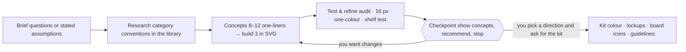

# Logo Design Skill for Claude & AI Agents

[](https://github.com/kaankiziltug/logo-design-skill/actions/workflows/test.yml) [](#)

A comprehensive **logo-design skill** that turns Claude — or any agent that supports Agent Skills, such as Gemini
CLI, Codex CLI, Cursor or GitHub Copilot — into a disciplined identity designer, from the first brief to
production-ready SVG files and brand guidelines.

- **Principles & process** — discovery and briefs, word mapping, choosing the right mark type, concepting,
 geometric construction, optical corrections (overshoot, bone effect, irradiation…), colour, typography, lockups,
 testing, presentation, delivery, redesigns and identity systems.
- **A reference library of 1,400+ real-world SVG logos**, each visually classified by mark type, technique,
 geometry, subject, typography, mood and industry — searchable from the command line and browsable in a local
 gallery. Used to study construction, map category conventions and avoid look-alikes (never to copy).
- **Dependency-free Python tools** — audit an SVG against logo principles, build concept overview sheets and test
 sheets (16 px pixel test, one-colour, reversed, squint, mirror, contexts, competitor shelf test), create client
 presentation boards with industry-specific mockups, render PNGs, and export a complete favicon / app-icon /
 web-manifest set.

**Contents:** [How it works](#how-it-works) · [Install](#install) · [Examples](#examples) ·
[Tests](#what-the-tests-catch) · [Use](#use) · [What's inside](#whats-inside) · [Library](#library-at-a-glance)

---

## How it works



The skill always **stops at the checkpoint**: it shows the concepts as one overview image with a recommendation and
offers the full kit. Nothing else is produced until you choose a direction — the kit is most of the work and only
makes sense for an approved idea.

---

## Install

### Claude Code — plugin marketplace (recommended)
```
/plugin marketplace add kaankiziltug/logo-design-skill
/plugin install logo-design@logo-design-skill
```

### Claude Code — manual
Copy the skill folder into your personal (all projects) or project skills directory:
```bash
git clone https://github.com/kaankiziltug/logo-design-skill.git
cp -r logo-design-skill/skills/logo-design ~/.claude/skills/logo-design # personal
# or: cp -r logo-design-skill/skills/logo-design .claude/skills/logo-design # per project
```

### Claude.ai / Claude Desktop
Download `logo-design.zip` from the [Releases](https://github.com/kaankiziltug/logo-design-skill/releases) page (or run
`python3 tools/package_skill.py`) and upload it under **Settings → Capabilities → Skills**. If your upload has a size
limit, use `logo-design-lite.zip` (everything except the SVG files themselves).

### Gemini CLI, Codex CLI and other agents
The skill uses the open **Agent Skills** format (a folder with a `SKILL.md`), so it works in any agent that supports
skills — the instructions are plain Markdown and the tools are plain Python. Clone once, then copy the folder into
your agent's skills directory:
```bash
git clone https://github.com/kaankiziltug/logo-design-skill.git
```

| Agent | Personal (all projects) | Per project |
|---|---|---|
| Gemini CLI | `~/.gemini/skills/logo-design` (or `~/.agents/skills/`) | `.gemini/skills/logo-design` |
| Codex CLI | `~/.codex/skills/logo-design` | `.codex/skills/logo-design` |
| Cursor, GitHub Copilot, OpenCode, others | see your agent's skills docs | usually a `skills/` folder in the project |

```bash
cp -r logo-design-skill/skills/logo-design ~/.gemini/skills/logo-design # Gemini CLI
cp -r logo-design-skill/skills/logo-design ~/.codex/skills/logo-design # Codex CLI
```
Start a new session and ask for a logo; the agent picks the skill up from its description. The skill works best with
a model that can view images, because it renders its own drafts to PNG and checks them before showing you anything.
The `.claude-plugin/` folder is only used by Claude Code and is ignored elsewhere.

---

## Examples

Twenty-eight fictional briefs, from quiet luxury and neon festivals to B2B SaaS, fintech and health — each run end to
end with the skill. For every brand you see exactly what the skill shows at the checkpoint (greyscale concepts with
true 64/32/16 px sizes and a recommendation), followed by a colour preview of the chosen direction on mockups picked
for that industry. Later batches deliberately push **vivid, saturated palettes** while still passing the one-colour
and 3 : 1 contrast checks. The newest batch takes on three crowded categories: **SaaS** (no chat bubbles, charts or
padlocks), **finance** (no coins, piggy banks or bank blue) and **health** (no crosses, pills or heartbeat lines).
The latest ten add another ten sectors. In four of them the client picked a different concept at the checkpoint than
the one the skill recommended, and the skill refined that choice before colouring it: exactly what the checkpoint is
for.

| Brand | Sector | Style | Chosen mark |
|---|---|---|---|
| [Kiln](#kiln--specialty-coffee-roaster) | Specialty coffee | Warm, crafted, modern | Letterform + custom wordmark |
| [Zestly](#zestly--food-delivery-app) | Food delivery | Juicy, cheeky, tomato & lime | Mascot |
| [Maison Orvelle](#maison-orvelle--luxury-fashion-atelier) | Luxury fashion | High-contrast Didone | Monogram |
| [Pulsewave](#pulsewave--music--arts-festival) | Music festival | Neon on night, kinetic | Abstract letterform |
| [Tinkertrail](#tinkertrail--kids-stem-workshops) | Kids' STEM education | Playful, rounded, multi-colour | Letterform |
| 